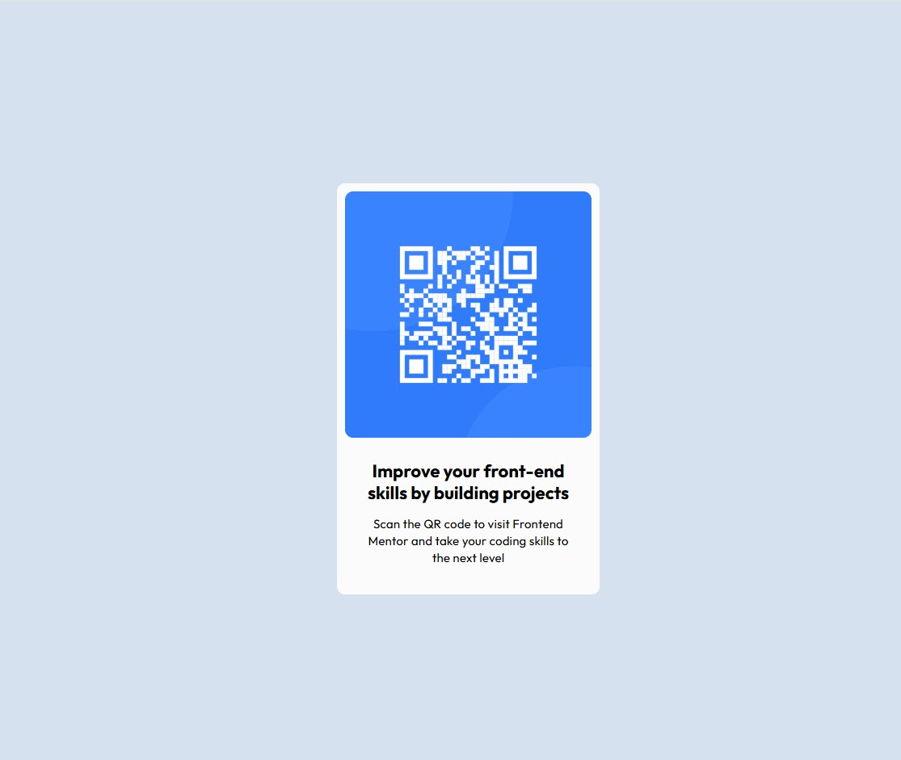

# Frontend Mentor - QR code component solution

This is a solution to the [QR code component challenge on Frontend Mentor](https://www.frontendmentor.io/challenges/qr-code-component-iux_sIO_H). Frontend Mentor challenges help you improve your coding skills by building realistic projects. 

## Table of contents

- [Overview](#overview)
  - [Screenshot](#screenshot)
  - [Links](#links)
  - [Built with](#built-with)
  - [What I learned](#what-i-learned)
- [Author](#author)

## Overview

### Screenshot

### Links

- Solution URL on Github: (https://carltonjohnson1.github.io/fm-qr-code-component/)

### Built with

- Semantic HTML5 markup
- CSS 
- Flexbox

### What I learned

It took me a while to figure out how to center the whole thing. I thought it would be straight-forward jusing flex and justify-content and align-items but it wasn't working as expected until I did the min-height of 100vh. 

## Author

- Website - [Carlton Johnson - Founder of Timely Web Design] (https://www.timelywebdesign.com)
- Frontend Mentor - [@carltonjohnson1](https://www.frontendmentor.io/profile/carltonjohnson1)
- Linkedin - (https://www.linkedin.com/in/carltonjohnson1/)
